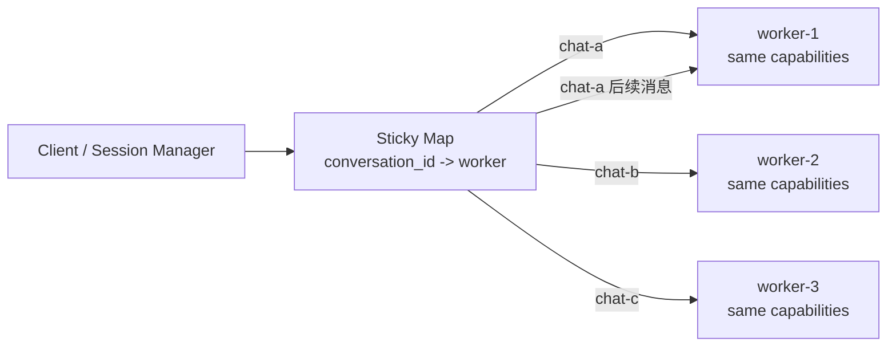

# ACP Standalone 多会话并发 Demo

这个 demo 聚焦一个具体问题：

> ACP standalone stdio 模式是双向单路连接，不适合在一个 Agent 进程里复用多个并发会话。要支持多个会话并发，Client 需要启动多个同能力 worker，并维护 `conversation_id -> worker` 的粘性映射。

这里的 Agent 能力是一样的，不做“Python/Rust/Skill”这种能力路由。Client 分配 worker 的依据只有一个：这个 conversation 之前绑定在哪个 worker 上。

## 快速开始

```bash
python3 -m venv .venv
source .venv/bin/activate
pip install -e .
acp-demo
```

调整 worker 数量：

```bash
acp-demo --workers 4
```

运行轻量测试：

```bash
PYTHONPATH=src python3 -m unittest discover -v
```

## 项目结构

- `src/acp_demo/worker_agent.py` - 完全同能力的 ACP standalone worker
- `src/acp_demo/agent_runtime.py` - stdio JSON-RPC Agent runtime
- `src/acp_demo/pool_client.py` - Client 侧 worker 池和粘性会话路由
- `src/acp_demo/run_demo.py` - 一键演示多会话并发
- `src/acp_demo/registry.py` - Registry，仅用于 worker 注册和健康观察，不转发对话
- `src/acp_demo/reconnection_demo.py` - 断连检测与重连演示
- `tests/` - 行为测试，覆盖 Registry API、Agent runtime、真实 worker 子进程池
- `docs/architecture.md` - 架构与流程图说明

## 核心模型



Client 的职责：

1. 启动多个同能力 standalone worker。
2. 新 conversation 进来时，按轮询或空闲策略选一个 worker。
3. 记录 `conversation_id -> worker_id/acp_session_id`。
4. 同一个 conversation 的后续消息必须回到同一个 worker。
5. 不同 conversation 可以落到不同 worker，从而并发。

## 为什么不能只启动一个 Agent

standalone stdio ACP 的连接模型更像：

```text
Client stdin/stdout <-> 一个 Agent 进程
```

这条通道是双向但单路的。一个请求在等响应时，Client 很难把另一条独立 conversation 的流式输出安全地混在同一条 stdout 里复用。即使协议有 `sessionId`，实际 stdio 管道仍然会出现调度、阻塞、流式消息交错和取消语义的问题。

所以这个 demo 采用更舒服的模型：

```text
多个 conversation 并发
        |
Client session manager
        |
多个 standalone ACP worker 进程
```

Registry 在这里不是路由器，只是 worker 目录和健康检查。
