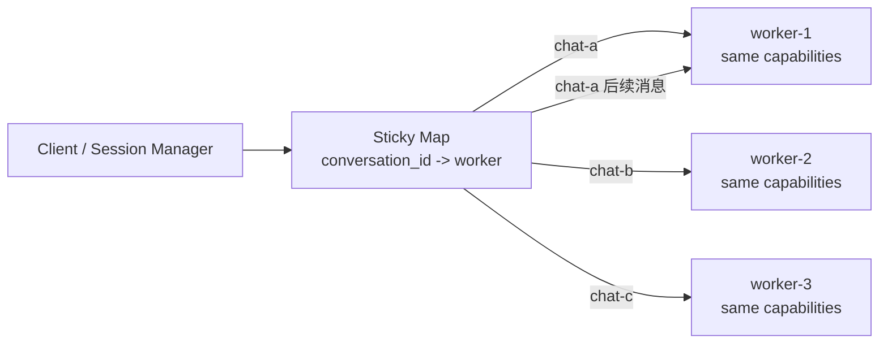

# ACP Standalone 多会话并发 Demo

这个 demo 聚焦一个具体问题：

> ACP standalone stdio 模式是双向单路连接，不适合在一个 Agent 进程里复用多个并发会话。要支持多个会话并发，Client 需要启动多个同能力 worker，并维护 `conversation_id -> worker` 的粘性映射。

这里的 Agent 能力是一样的，不做“Python/Rust/Skill”这种能力路由。Client 分配 worker 的依据只有一个：这个 conversation 之前绑定在哪个 worker 上。

## 快速开始

要求：

- Python 3.10+
- 本机 `127.0.0.1:3000` 端口空闲（完整 demo 会在这个端口启动 Registry）

这个项目不需要 LLM API key，也不需要外部 ACP 服务。Demo 里的 worker 都是本地 Python 子进程，通过 stdio JSON-RPC 通信。

### 1. 创建虚拟环境并安装

```bash
python3 -m venv .venv
source .venv/bin/activate
python -m pip install -e .
```

### 2. 运行完整多 worker 演示

```bash
acp-demo
```

调整 worker 数量：

```bash
acp-demo --workers 4
```

完整 demo 会自动完成这些事：

1. 启动 Registry（只负责 worker 注册和健康观察）。
2. 启动多个完全同能力的 ACP standalone worker。
3. 模拟多个 conversation 并发请求。
4. 打印 `conversation_id -> worker` 的粘性映射。
5. 演示结束后自动清理子进程。

如果想在演示结束后保留 Registry/Worker 进程，方便另开终端观察：

```bash
acp-demo --workers 3 --keep-alive
```

按 `Ctrl+C` 退出并清理进程。

### 3. 运行轻量 client 演示

如果只想看“同一个 conversation 回到同一个 worker”的最小路径：

```bash
acp-client
```

这个命令不会启动 Registry，只会启动两个本地 worker 子进程，然后打印粘性映射。

### 4. 单独运行 Registry

```bash
acp-registry
```

Registry 默认监听 `http://127.0.0.1:3000`，常用端点：

```bash
curl http://127.0.0.1:3000/health
curl http://127.0.0.1:3000/agents
curl http://127.0.0.1:3000/capabilities
```

注意：Registry 只保存 worker manifest 和心跳状态，不转发对话请求。对话路由仍然在 Client 侧完成。

### 5. 运行断连重连演示

```bash
acp-reconnect-demo
```

这个 demo 会启动一个可能随机崩溃的本地 Agent，展示 Client 如何检测断连、重启进程并尝试恢复 session。

### 6. 通过 ACP 启动 Hermes Agent

如果你希望这个 demo 作为 ACP Client，启动本机 Hermes Agent 并与它交互，可以运行：

```bash
acp-hermes
```

或者不安装包时：

```bash
PYTHONPATH=src python3 -m acp_demo.hermes_acp_client
```

它会启动：

```bash
hermes acp
```

然后按 ACP stdio JSON-RPC 完成：

1. `initialize`
2. `session/new`
3. 可选的 `session/prompt`

只做连接和建 session：

```bash
acp-hermes
```

发送一条 prompt 给 Hermes：

```bash
acp-hermes --prompt "你好，请用一句话说明你是通过 ACP 启动的 Hermes Agent"
```

注意：这里的 MCP 是 Hermes 在 ACP session 中可以加载的工具服务器能力，配置会通过 `session/new` 的 `mcpServers` 参数传给 Hermes；启动和对话本身走的是 ACP。

## 测试

安装后运行：

```bash
python -m unittest discover -v
```

如果没有安装包，也可以临时指定源码路径：

```bash
PYTHONPATH=src python3 -m unittest discover -v
```

当前测试会覆盖：

- Registry API：`/register`、`/agents`、`/search` 等接口。
- Agent runtime：`initialize`、`session/new`、`session/prompt` 和流式 `session/update`。
- Worker pool：启动真实 worker 子进程，验证 conversation 粘性路由。
- Hermes ACP client：验证 client 可以启动 ACP agent，并通过 stdio 完成 `initialize`、`session/new`、`session/prompt`。

## 常见问题

### `acp-demo` 卡在 Registry 启动或启动失败

通常是 `127.0.0.1:3000` 已被占用。可以先查占用进程：

```bash
lsof -i :3000
```

释放端口后再运行 `acp-demo`。

### 为什么 `acp-client` 不显示 Registry 里的 agents

`acp-client` 是最小粘性路由演示，不依赖 Registry。要看 Registry 注册和健康检查流程，请运行 `acp-demo` 或单独运行 `acp-registry`。

## 项目结构

- `src/acp_demo/worker_agent.py` - 完全同能力的 ACP standalone worker
- `src/acp_demo/agent_runtime.py` - stdio JSON-RPC Agent runtime
- `src/acp_demo/pool_client.py` - Client 侧 worker 池和粘性会话路由
- `src/acp_demo/hermes_acp_client.py` - ACP Client，用于启动 `hermes acp` 并与 Hermes Agent 交互
- `src/acp_demo/run_demo.py` - 一键演示多会话并发
- `src/acp_demo/registry.py` - Registry，仅用于 worker 注册和健康观察，不转发对话
- `src/acp_demo/reconnection_demo.py` - 断连检测与重连演示
- `tests/` - 行为测试，覆盖 Registry API、Agent runtime、真实 worker 子进程池
- `docs/architecture.md` - 架构与流程图说明

## 核心模型



Client 的职责：

1. 启动多个同能力 standalone worker。
2. 新 conversation 进来时，按轮询或空闲策略选一个 worker。
3. 记录 `conversation_id -> worker_id/acp_session_id`。
4. 同一个 conversation 的后续消息必须回到同一个 worker。
5. 不同 conversation 可以落到不同 worker，从而并发。

## 为什么不能只启动一个 Agent

standalone stdio ACP 的连接模型更像：

```text
Client stdin/stdout <-> 一个 Agent 进程
```

这条通道是双向但单路的。一个请求在等响应时，Client 很难把另一条独立 conversation 的流式输出安全地混在同一条 stdout 里复用。即使协议有 `sessionId`，实际 stdio 管道仍然会出现调度、阻塞、流式消息交错和取消语义的问题。

所以这个 demo 采用更舒服的模型：

```text
多个 conversation 并发
        |
Client session manager
        |
多个 standalone ACP worker 进程
```

Registry 在这里不是路由器，只是 worker 目录和健康检查。
