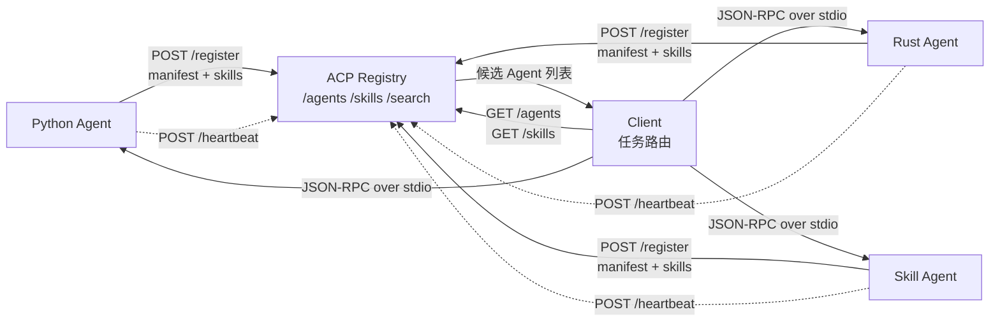

# ACP 多 Agent Demo

这是一个用于学习 ACP 风格多 Agent 协作的最小完整 demo。它演示：

- Agent 启动后向 Registry 注册 manifest
- Client 从 Registry 发现 Agent、能力和 Skill
- Client 根据任务选择合适 Agent
- Client 与 Agent 通过 stdin/stdout 发送 JSON-RPC 消息
- Agent 发送 `session/update` 流式消息，再返回最终 response
- Client 检测断连并尝试重连

## 快速开始

```bash
python3 -m venv .venv
source .venv/bin/activate
pip install -r requirements.txt
python3 run_demo.py
```

想让 Registry 和 Agent 保持运行，再另开终端体验独立 Client：

```bash
python3 run_demo.py --keep-alive
python3 client.py
```

断连重连演示：

```bash
python3 reconnection_demo.py
```

运行轻量测试：

```bash
python3 -m unittest discover
```

## 项目结构

- `registry.py` - ACP Registry，负责注册、发现、心跳、Skill 查询
- `agent_runtime.py` - 通用 stdio JSON-RPC Agent runtime
- `agent_a.py` - Python Agent
- `agent_b.py` - Rust Agent
- `agent_skill.py` - Skill Agent，演示如何把现成 Codex Skill 暴露到 manifest
- `skill_catalog.py` - Skill catalog，会尝试扫描本机 `~/.codex` 下的 `SKILL.md`
- `client.py` - 独立 Client demo
- `run_demo.py` - 一键完整演示
- `reconnection_demo.py` - 断连检测与重连演示
- `docs/architecture.md` - 架构与流程图说明

## 核心流程



更完整的图解见 [docs/architecture.md](docs/architecture.md)。

## Registry API

- `GET /health` - Registry 健康检查
- `GET /agents` - 列出 Agent
- `GET /agents?capability=python` - 按能力筛选 Agent
- `GET /capabilities` - 列出所有能力标签
- `GET /skills` - 列出所有 Skill 以及它们由哪些 Agent 暴露
- `POST /search` - 按能力、Skill、输入类型搜索 Agent
- `POST /register` - Agent 注册
- `POST /heartbeat` - Agent 心跳
- `POST /unregister` - Agent 注销

## 学习重点

本 demo 里的 Registry 更像“发现服务”，告诉 Client 哪些 Agent 存在、它们会什么、怎么启动或连接。真正的对话不经过 Registry，而是 Client 和 Agent 之间直接通信。

当前实现用的是本地 stdio transport；如果未来换成远程 HTTP/WebSocket transport，Registry 的 manifest 里可以放 `endpoint`，Client 选择 Agent 后改为连接远程地址即可。
