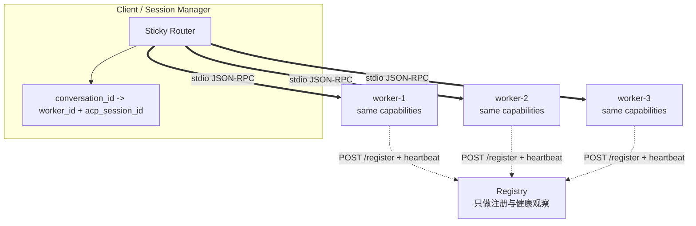
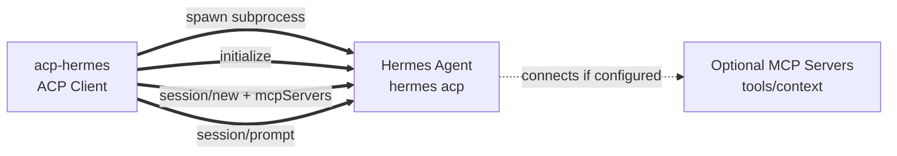
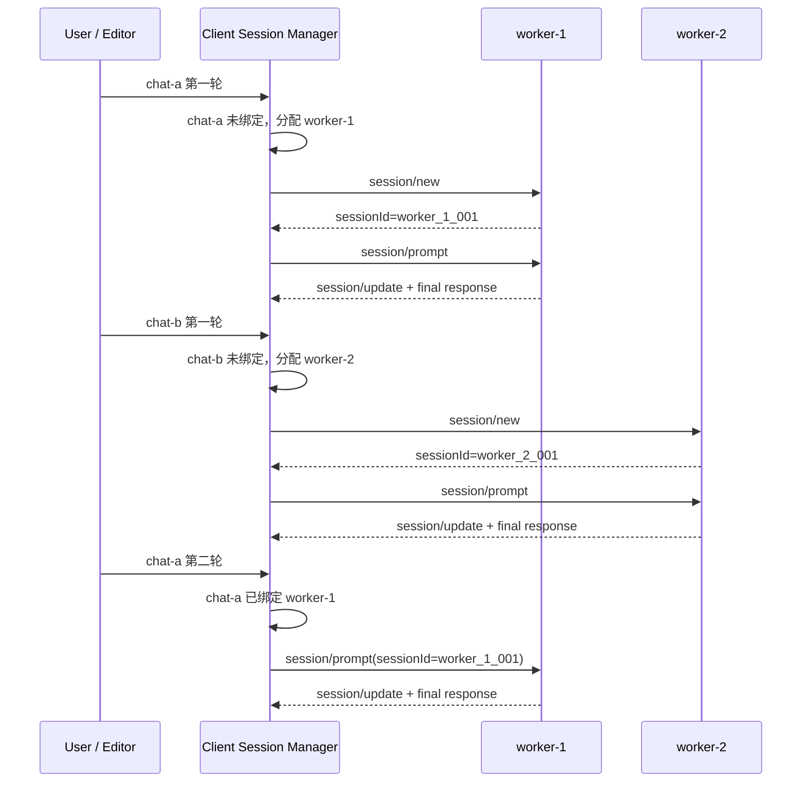
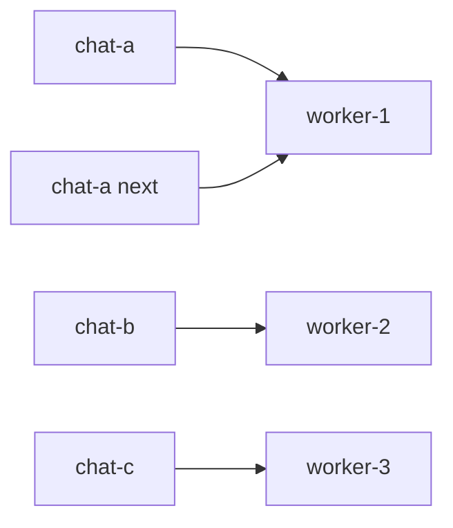

# ACP Standalone Worker Pool 架构图解

这份文档解释“同能力 Agent + 多会话并发”的核心设计。

## 1. 问题

ACP standalone stdio 模式下，一个 Agent 进程通常对应一条双向 stdio 通道：

这条通道可以双向通信，但它不是天然的多路复用通道。多个 conversation 的流式 update、最终 response、取消和超时如果都挤在一条管道里，Client 会很难做清晰的并发隔离。

## 2. 目标模型

启动多个完全同能力 worker，让 Client 维护会话亲和：

Registry 只告诉你 worker 存在与否，不决定某条消息去哪里。真正的路由状态在 Client 里。

## 2.1 Hermes ACP 启动入口

如果这个 demo 作为 Client 启动 Hermes Agent，链路是：

这里的“注册”主要发生在 ACP session 创建阶段：

1. Client 启动 `hermes acp`，Hermes 作为 ACP server 暴露 `initialize`、`session/new`、`session/prompt` 等方法。
2. Client 在 `session/new` 里把可选 `mcpServers` 传给 Hermes，Hermes 再加载这些 MCP 工具。
3. 后续 prompt 都通过 ACP `session/prompt` 进入同一个 Hermes session。

## 3. 粘性路由

关键点：`chat-a` 的第二轮不能重新分配，必须回到 `worker-1` 的同一个 ACP session。

## 4. 并发来源

并发不是来自“一个 standalone Agent 内部多路复用”，而是来自“多个 standalone Agent 进程并行运行”。

## 5. 测试覆盖

当前测试不是单纯测配置：

- `test_registry_api.py` 启动临时 HTTP Registry，真实请求 `/register`、`/agents`、`/search`。
- `test_agent_runtime.py` 直接验证 runtime 会返回 worker identity、session state 和 `session/update`。
- `test_pool_client.py` 启动两个真实 worker 子进程，验证 `chat-a` 第二轮仍然回到原 worker。
