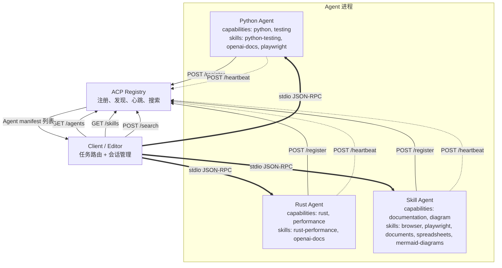
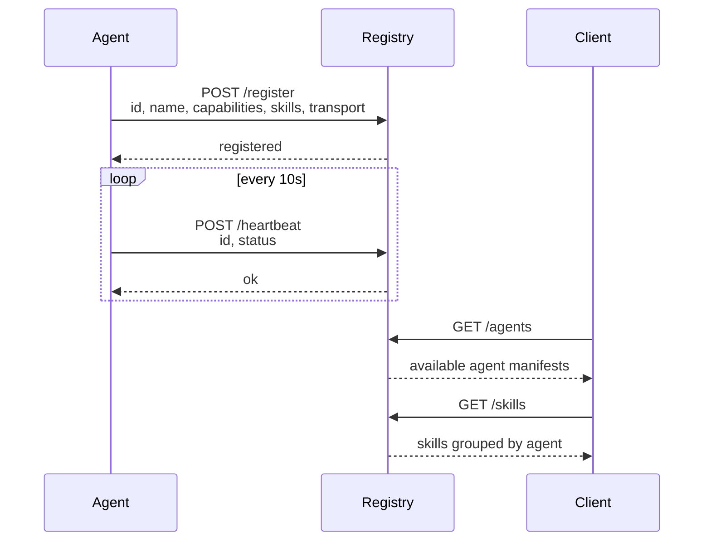
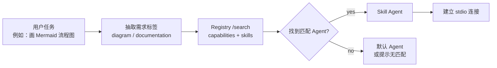
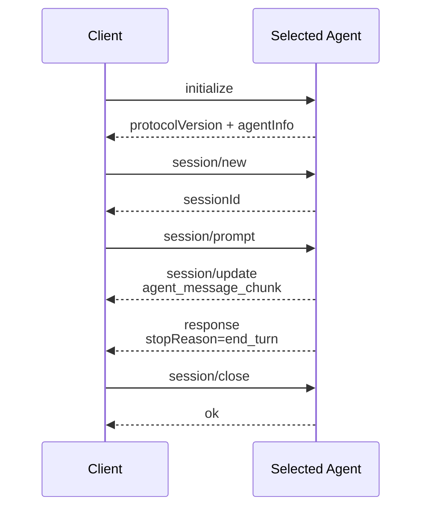
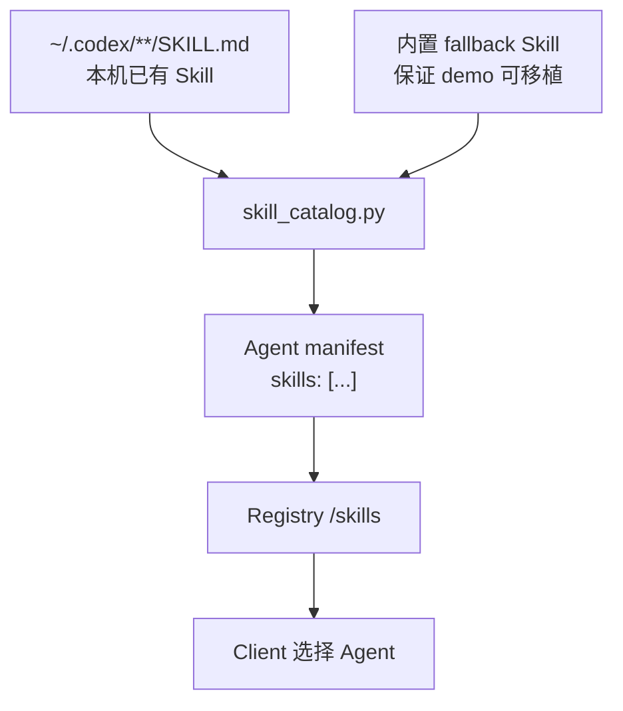
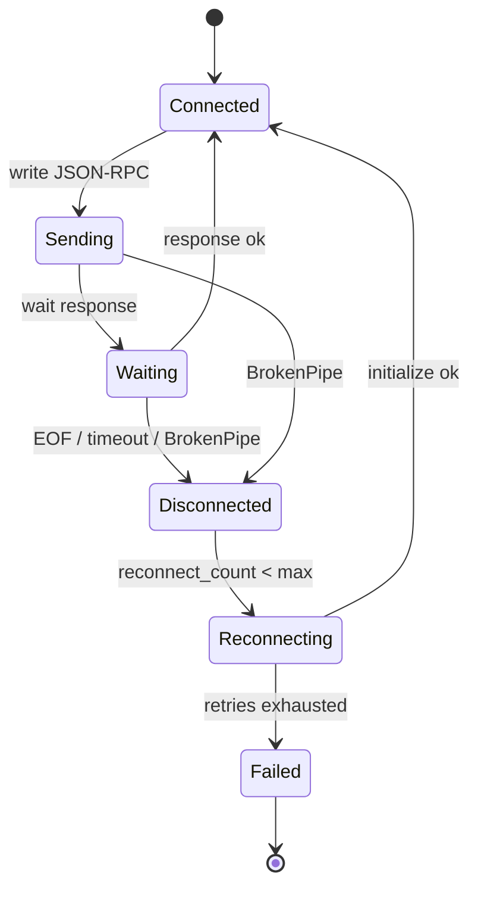

# ACP Demo 架构图解

这份文档用 Mermaid 图解释 demo 的运作原理。你可以把它当作读代码前的地图。

## 1. 总览

## 2. 注册与发现

Registry 保存的是“可发现信息”：Agent 名字、能力、Skill、transport、endpoint 或启动信息。它不转发对话内容。

## 3. Client 路由逻辑

在当前 demo 里，路由规则故意保持简单：任务类型命中 `capabilities` 或 `skills.name` 就选择该 Agent。真实系统可以把这里替换成 embedding 检索、策略引擎或模型路由器。

## 4. stdio JSON-RPC 会话

这里最容易踩坑的是 `session/prompt`：Agent 可以先发多个 `session/update`，最后才发和请求 `id` 对应的 response。Client 不能只读一行，而要持续读到匹配的 response 为止。

## 5. Skill 如何进入 manifest

`skill_catalog.py` 会尝试扫描本机 `~/.codex` 下的 `SKILL.md`。如果某些 Skill 不存在，就使用项目内置的 fallback 描述，所以 demo 在没有 Codex Skill 环境的机器上也能运行。

## 6. 断连与重连

`reconnection_demo.py` 使用 `crash_agent.py` 模拟随机崩溃，Client 会检测 EOF、超时和 BrokenPipe，然后重新启动 Agent，并尝试恢复 session。
